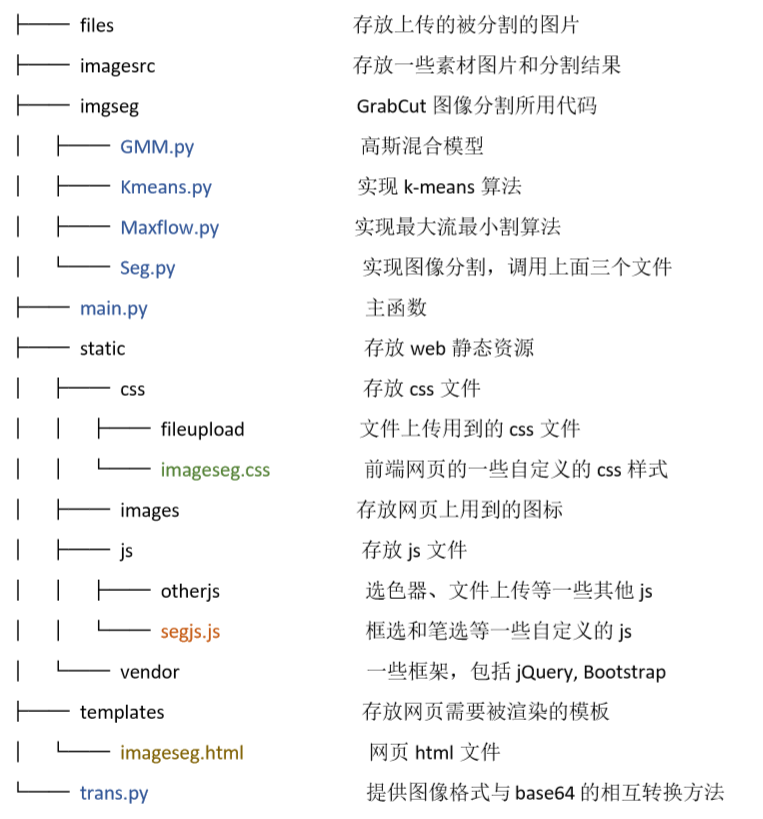
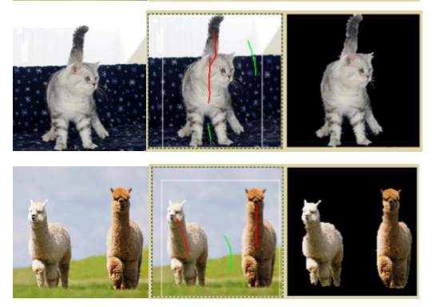

###Image Segment Based on GrabCut
根据GrabCut方法，即法把图像分割问题与图的最小割问题相关联，实现前后景的分离。

####File Structure
如图

其中取色器 js，即 static->js->otherjs->colorpicker 中的内容来自于 [colorpicker](https://github.com/vanderlee/colorpicker)

####Environment
python|3.6.9
:-:|:-:
flask|1.1.1
pillow|4.3.0
numpy| 1.14.1
matplotlib|3.1.1
opencv|3.3.0

####How it works
在main.py运行后，进入web。对图像的标记包括两方面，一是用矩形框选取可能的前景，框外的像素一定是背景。二是笔标记，红色笔标记的是前景，绿色笔标记的是背景。不过笔标记是可选的，当只用矩形框有的部分分割不正确或部分前景不想要时，可以选择笔标记。 

####result example
